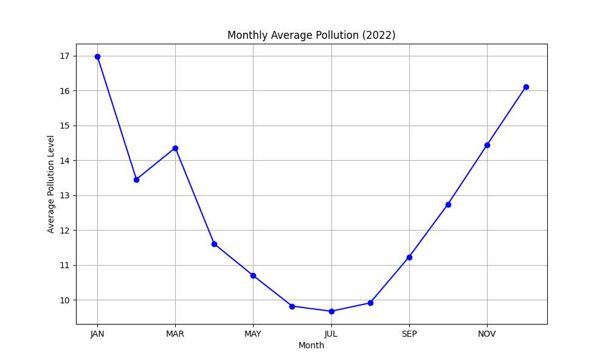
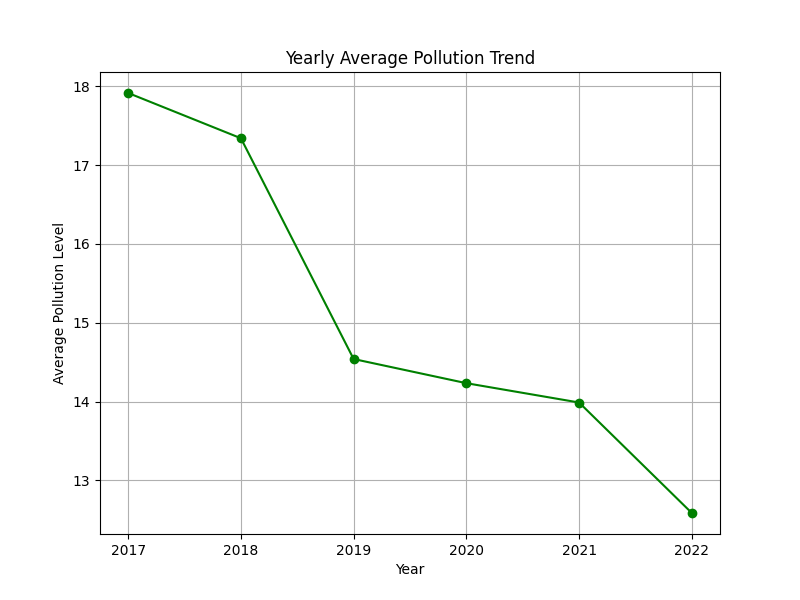

# 🌍 Air Pollution Analysis Project

This repository contains an exploratory data analysis (EDA) project on global air pollution trends.  
It was created as part of an internship assignment for **Digineta**.

- **Skills demonstrated:** Data Cleaning, EDA, Data Visualization, Dashboarding
- **Tools used:** Python (Pandas, Matplotlib), Power BI

---

## 📌 Project Overview

Air pollution is a major global health risk. The goal of this project is to analyze air pollution data across cities and years, identify key trends, and visualize insights that can help inform decisions.

In this project, I performed:
- Data Cleaning of the raw dataset
- Exploratory Data Analysis (EDA)
- Visualization of trends (Python + Power BI)
- Summary of key insights


---


## 🛠️ Process

### 1️⃣ Data Cleaning

- Missing values handled (`-` replaced with `NaN`)
- All pollution-related columns converted to numeric
- Cleaned data saved to `cleaned_air_pollution.csv` for further analysis and dashboarding

### 2️⃣ Exploratory Data Analysis (EDA)

#### ➤ In Python

- **Top 10 Most Polluted Cities (2022)** → CSV + Bar Chart
- **Top 10 Least Polluted Cities (2022)** → CSV + Bar Chart
- **Monthly Average Pollution Trend** → Line Chart
- **Yearly Average Pollution Trend** → Line Chart

#### ➤ In Power BI (next commit)

- Full dashboard with key charts for visualization and storytelling
- Visual comparison of top & least polluted cities
- Time-series visualization of trends

---

## 📊 Results

### Graphs

#### 1️⃣ Monthly Average Pollution Trend



#### 2️⃣ Yearly Average Pollution Trend



#### 3️⃣ Power BI Dashboard (Coming Soon 🚀)

*(Will add screenshot in next commit)*

---

## 💡 Key Insights

- The **most polluted cities** in 2022 were concentrated in **South Asia** — mainly **India, Pakistan**, and **China**.
- **Winter months** (October to December) consistently showed **higher pollution levels**, likely due to weather patterns and human activities.
- **Summer months** had comparatively lower pollution.
- **Yearly trends** indicate a **drop in pollution in 2020**, likely due to global **COVID-19 lockdowns**, followed by a rebound in 2021–2022.
- Data-driven dashboards can help monitor pollution trends and inform environmental policies.

---

## 🚀 How to Run the Project

```bash
# Clone this repo
git clone <your-repo-url>

# Navigate into project folder
cd Air-Pollution-Analysis

# Run main.py to generate outputs and graphs
python main.py
