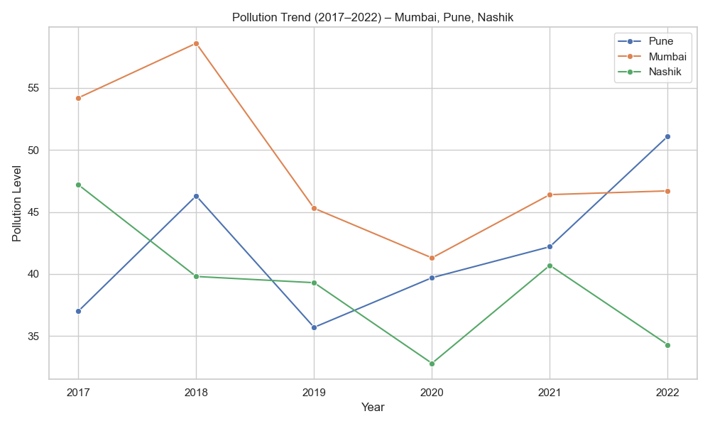
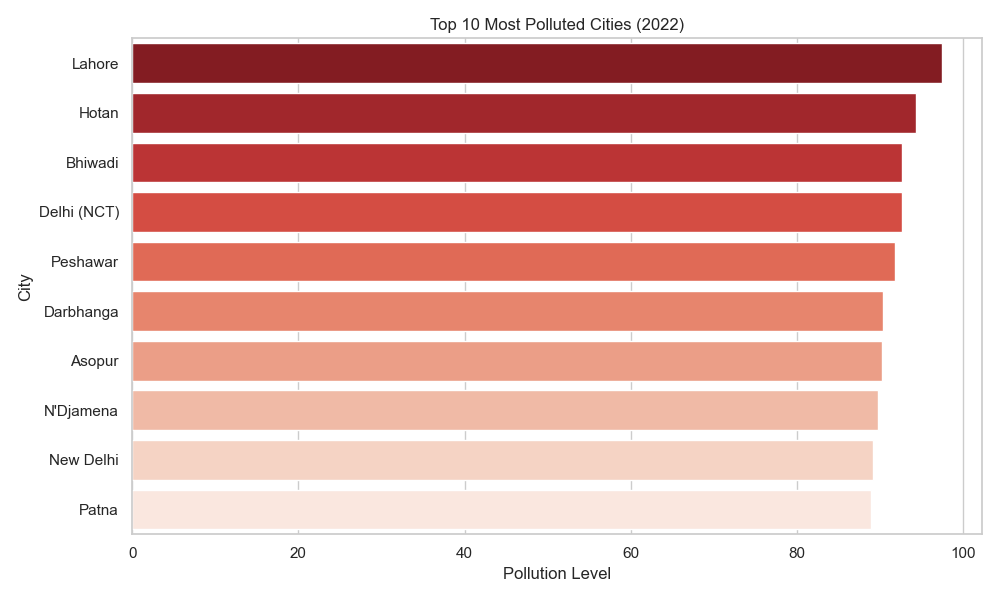
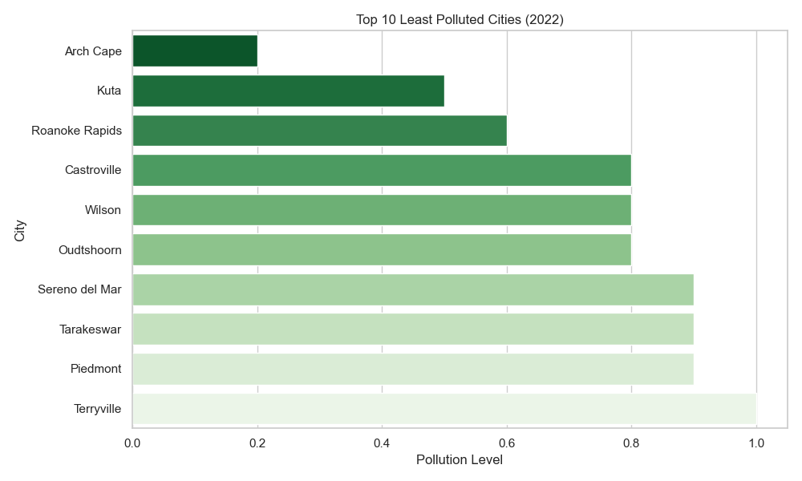
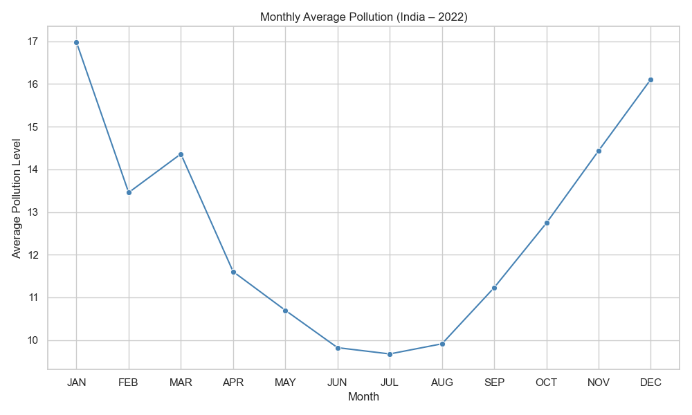
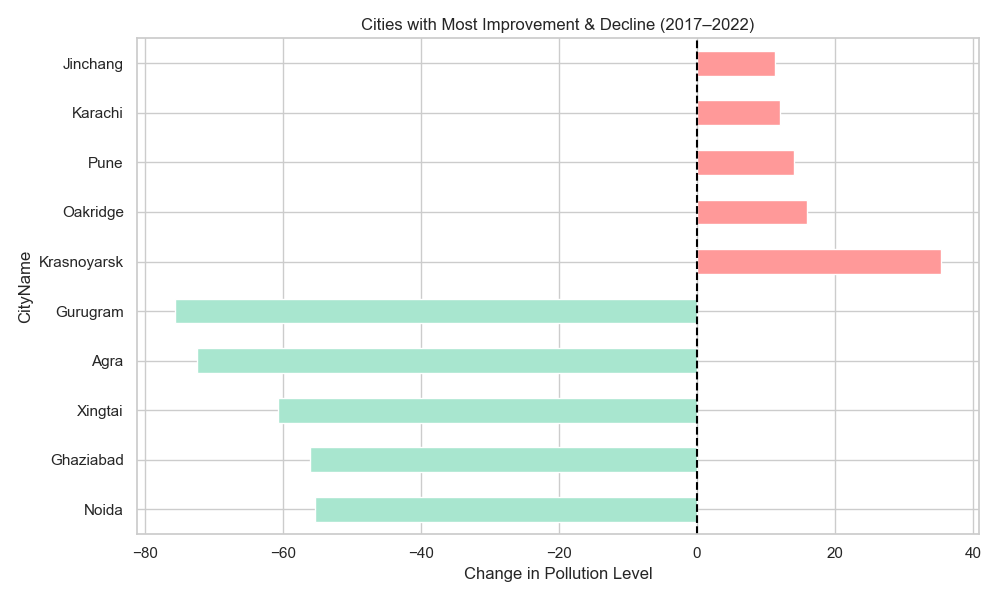
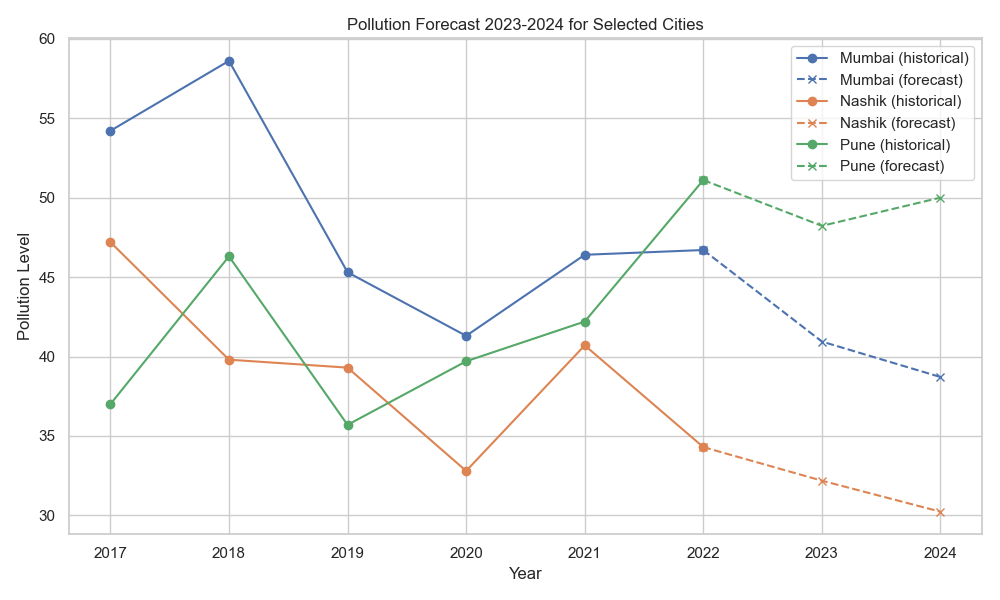
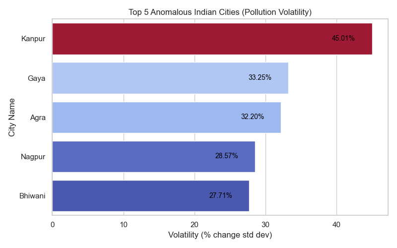

# 🌍 Air Pollution Analysis Project

This repository contains an exploratory data analysis (EDA) project on global air pollution trends.  
It was created as part of an internship assignment for **Neubrain Solutions**, an AI & Strategy consulting firm based in Mumbai.

- **Skills demonstrated:** Data Cleaning, Exploratory Analysis, Insight Communication, Data Visualization, Time Series Forecasting, Anomaly Detection  
- **Tools used:** Python (Pandas, Seaborn, Matplotlib, Scikit-Learn)


---


## 📌 Project Overview

Air pollution is one of the most urgent environmental challenges globally.  
This project analyzes pollution levels across hundreds of cities over several years to uncover key patterns, detect anomalies, and generate **forecast-driven** and **volatility-based** visuals for strategic decisions.


---


## 🛠️ Process

### 1️⃣ Data Cleaning

- Replaced placeholder values (`-`) with `NaN`
- Converted all pollution columns to numeric format
- Split the original `City` column into two separate columns: `CityName` and `Country`
- Rearranged year columns (`2017` to `2022`) into chronological order
- Saved the cleaned dataset as `data/cleaned_air_pollution.csv` for reuse in visualizations and Power BI


---


## 📊 Visual Analysis (Python + Seaborn/Matplotlib)

### 📈 1. Mumbai vs Pune vs Nashik – Pollution Over Years


**Interpretation:**  
This multi-line chart shows how air pollution levels changed in three key Maharashtra cities between 2017 and 2022. While all cities saw a dip in 2020, Pune maintained a relatively lower pollution level compared to Mumbai and Nashik.


---


### 🌆 2. Top 10 Most Polluted Cities (2022)


**Interpretation:**  
This enhanced bar chart uses a color gradient to show the intensity of pollution. Most of the top 10 cities are in India, showcasing the regional concentration of air quality issues.


---


### 🍃 3. Top 10 Least Polluted Cities (2022)


**Interpretation:**  
These cities recorded the lowest pollution in 2022. The lightest bars represent the cleanest air, reflecting lower industrial density and better environmental regulations.


---


### 📅 4. Monthly Average Pollution Trend


**Interpretation:**  
Pollution peaks in **winter months** (Nov–Jan) and dips during the **monsoon and summer** (June–August), reflecting seasonal human and industrial activities.


---


### 🔄 5. Pollution Improvement vs Decline (2017–2022)


**Interpretation:**  
This pastel-colored chart shows the top 10 cities with the most improvement (green) and worst decline (red) in pollution levels over five years. While cities like Pune improved, others like Jaipur worsened significantly.


---


### 🔮 6. Pollution Forecast for Key Indian Cities (2023 & 2024)


**Interpretation:**  
This chart uses a **Linear Regression model** to forecast pollution levels for **2023 and 2024** for selected Indian cities (Mumbai, Pune, Nashik).  

- **Solid lines** represent actual historical pollution trends (2017–2022).  
- **Dashed lines** represent predicted pollution levels for future years (2023–2024).

Observations:
- Mumbai shows a slightly declining trend into 2024.
- Nashik and Pune exhibit different forecast behaviors, highlighting **diverging air quality patterns** even within the same region.
- This type of **time series modeling** helps anticipate air quality risks and supports better urban planning.


---


### ⚠️ 7. Top 5 Anomalous Indian Cities (Pollution Volatility)


**Interpretation:**  
This bar chart ranks Indian cities by **pollution volatility**, calculated as the standard deviation of year-on-year percentage change in pollution.  
Higher volatility suggests irregular and unstable pollution patterns, possibly due to varying industrial activity, meteorological factors, or data quality issues.

**Current Top 5 Most Volatile Indian Cities:**

| City    | Volatility (%) |
|---------|----------------|
| Kanpur  | 45.01%         |
| Gaya    | 33.25%         |
| Agra    | 32.19%         |
| Nagpur  | 28.57%         |
| Bhiwani | 27.71%         |


---


## 💡 Key Insights

- **South Asian cities**, especially in **India**, dominate the list of most polluted locations.
- **Winter seasons** consistently see a surge in pollution due to climatic and cultural factors (e.g., festivals, stubble burning).
- **2020** witnessed a sharp decline in pollution globally, likely due to **COVID-19 lockdowns**.
- Cities like **Pune** show potential as success stories with declining pollution trends.
- Some cities like **Kanpur** and **Gaya** exhibit highly volatile pollution patterns, requiring deeper investigation and possible **policy attention**.
- Forecasting tools and volatility analysis provide new ways to **proactively monitor pollution risks**.


---


## 🚀 How to Run the Project

```bash
# 1. Clone the repository
git clone <your-repo-url>

# 2. Navigate to the project directory
cd Air-Pollution-Analysis

# 3. Install dependencies
pip install pandas numpy matplotlib seaborn scikit-learn

# 4. Run the main script to generate outputs
python main.py
